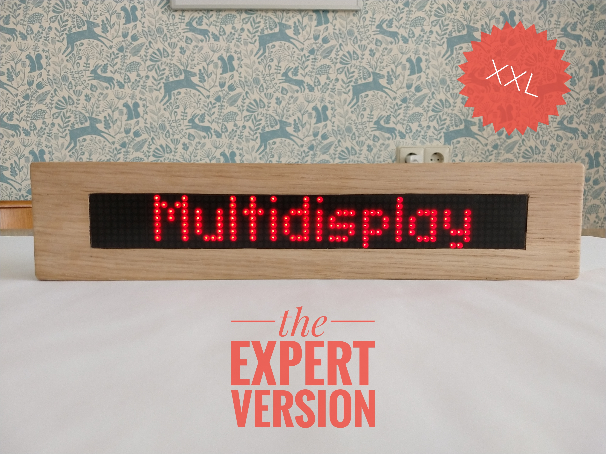
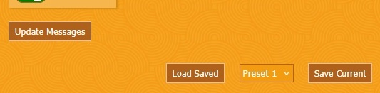
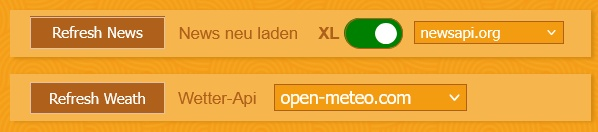
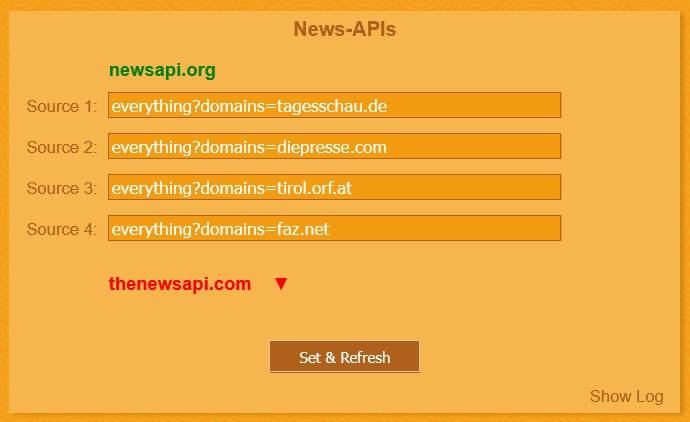

# Tobers Multidisplay XXL
Tobers Multidisplay XXL for ESP32 and MAX7219 8x8 LED matrix modules is the expert version of [Tobers Multidisplay](https://github.com/ElToberino/Tobers_Multidisplay). 
In addition to the well-known features of *Tobers Multidisplay* it can also show graphic animations. Besides that there are lots of optimizations and nearly everything is configurable during runtime; you can even use different news and weather APIs.  
**Note:** You should be familiar with *Tobers Multidisplay* and only try out this new version if you know how the program works and how to set up everything. As this software is "experts only" there is no support. 
If you are happy with *Tobers Multidisplay* and it meets your needs, it's better to stay with the old version. It is still maintained and supported. 
If you want more and you don't mind about things getting more complicated you can go on. 
**Please read the following information carefully before starting your project.**   

  

 

**About** 
Always keeping *Tobers Multidisplay* up to date I considered adding new functions and optimizations to it. But as I don't want to drop support for ESP8266 and as I don't want to make it much more complicated for the many users that like my display very much, I've decided to set up a completely new project. 
(Still in pre-AI era) I began with integrating the graphic animations of the [MD_MAX72xx Library by majicDesigns](https://github.com/MajicDesigns/MD_MAX72XX). After that I got more and more ideas and now there is a program with lots of new features and even more optimizations under the hood. Finally, during the last months, I used some AI help for fine-tuning and adding some features like multiple file upload. Going through the code you will still see the base from original Multidisplay on which a mighty program has been built. 
Please note: This is not a fork but a completely new version, so updating via OTA does not work. You have to upload both code and files.

**New features:**
- graphic animations (as shown in the "Daft Punk" example in [MD_MAX72xx Library](https://github.com/MajicDesigns/MD_MAX72XX/blob/main/examples/MD_MAX72xx_DaftPunk/MD_MAX72xx_DaftPunk.ino), a video is [here](https://www.youtube.com/watch?v=UVcUQzxbfUM)) 
- service messages (example: "News Service" is shown before news message)
- support of LDR sensor for automatic brightness setting
- different APIs, all configurable during runtime
- API-Logs
- optional combined date and time mode for large displays
- optional time with seconds during message loop
- shuffle mode for text effects and graphic animations
- multiple file upload and download (SPIFFS), support of gzip files

**Under the hood:**
* lots of optimizations (String handling, Wifi, Time, dynamic html, ...) and code simplifications.
  
 

**Requirements**
* *Hardware:* 
Classic ESP32 (4MB Flash) 
Max7219 8x8 LED matrix modules (Meanwhile I use displays with up to 20 modules) 

* *Arduino IDE and the following libraries:* 
[MD_MAX72xx Library by majicDesigns](https://github.com/MajicDesigns/MD_MAX72XX) 
[Parola Library by majicDesigns](https://github.com/MajicDesigns/MD_Parola) 
[Arduino Json library by Benoit Blanchon](https://github.com/bblanchon/ArduinoJson) 
[My fork of WifiManager library (development branch) by tzapu/tablatronix](https://github.com/ElToberino/WiFiManager_for_Multidisplay) 

* *Installed boards:* 
[ESP32 core for Arduino](https://github.com/espressif/arduino-esp32) 
Note: I highly recommend V 2.0.17. 

* *Recommended tools:* 
[ESP32 Data Upload Tool](https://github.com/me-no-dev/arduino-esp32fs-plugin) 

* *Required accounts:* 
WEATHER: personal api key from [openweathermap.org](https://openweathermap.org/) 
NEWS: personal api key from [newsapi.org](https://newsapi.org/) and from [thenewsapi.com](https://thenewsapi.com/)  
SPOTIFY: premium account AND [developer registration of your device](https://developer.spotify.com/dashboard/)
  

**Setup** 
All settings required have to be done on top of the code in the /// USER SETTINGS /// section. All other configuration is done during runtime via config.html. 
 

**Messages (admin.html)** 
All messages are set via admin.html.  
The first message and the first graphic slot are stand alone slots if all other slots are deactivated. Stand alone message means that the message sent is printed on display (static) and will stay there. Standalone graphic means that the graphic chosen is repeated indefinitely. 
 
 
"Update Messagse" sends your configuration to display. 
"With "Save Current" und "Load Saved" you can save/load your configuration into/from five presets. Preset 0 is loaded on startup.
 
 

**Configuration - New features (config.html)** 
  
  
 New option "Au" for automatic brightness setting (if LDR sensor attached) 
  
  
 Set Device Name (shown on html sites) 
  
  
 Set Time Mode 
  
  
 Enable or Disable Sevice Message 
  
  
 Choose API Type 
  
  
 Set NTP Server 
  
  
 Set Refresh Intervals 
 
 
Enable or Disable and Configure HTML Authentication for private Sites 
 
Note: All settings made via config.html are automatically saved to file. 
Clicking "Display" on top of the site reveals detailed information of the device. 
 
 

**APIs (api.html)** 
 
On api.html you can change newssources and weather coordinates. 
Active API(s) as configured on config.html are the green ones. Inactive APIs (red) can also be configured. 
There are also logs available for all API calls including time server call. 
Note: On this site changes are only saved persistently to file by clicking "Save Current". 
 
 
**Spotify** 
Please note that Spotify has recently limited the lifetime of the refreshtoken; it expires after 180 days. That means you have to do the authentication process again after this time. You can see the remaining lifetime of the refreshtoken in the Music Api Log on api.html. 
 
If you get problems connecting to Spotify, please check if the TLS certificates (saved in *cert_spot.txt* and *cert_spot_api.txt*) have changed. You can find this out with your browser: Go to *accounts.spotify.com* and *api.spotify.com*, click the key symbol in the address bar and compare the certificates. If they are different, change the files and upload them (a restart is required after that).
   
**FAQ** 
Why don't you provide a tutorial for setting up the display? 
*This is the expert version of my Multidisplay. Users should know how Tobers Multidisplay works and understand what's happening under the hood before using this expert version. Please note that there is no support for this expert version.* 
 
I want to use a small display with few modules. Will it work? 
*Sure. This XXL version has some functions designed for larger displays, but you can easily deactivate them if they don't fit on your display (service messages, combined time/date).* 
 
Why do you recommend V 2.0.17 of ESP32 core for Arduino? 
*1. The compiled binary file has become very large with core 3 and does no longer fit into the standard sketch/ota partition scheme. If you want to compile with core 3 you have to use a custom partition scheme. 
2. With core 3 I faced some issues with http client occurring after about 20 hours of uptime. I did a lot of investigation and I'm sure that this is a specific core 3 problem that can not be handled with code adjustments. With core 2 everything runs fine for days.* 
 
Can I just update via OTA from my existing *Tobers Multidisplay"? 
*No. This is not a fork but a completely new version of the program with different files. Erase chip completely and do a clean, fresh install.* 
 
Where are the English html files? 
*To keep it simple I do not provide two versions of the html files (as you know it from the former version).  
As an expert you can easily adapt the html files; but this is only a cosmetic issue and not necessary as the sites are self-explaining. 
Of course the English language version for the messages on display is still implemented.* 
 
Why can I choose on "Musikinfo" between Spotify, Castweb and Info extern? 
*The support of Castweb is experimental and not recommended. It is based on on the [cast-web-api by vervallsweg](https://github.com/vervallsweg/cast-web-api) which is no longer maintained and very difficult to set up. It's better to just ignore this function. 
Info extern is a simple API of my program: You can send a simple json string containing "Artist - Song" to "DEVICE_IP/musicInfo" and the display will show this string as music information. Take a look at the code for further information.* 
 
Which API do you prefer? 
*As always - it depends.. Take a look at the API features and decide which one meets your requirements better. Testing is easy as APIs and news sources can be changed during runtime. But keep in mind the daily call limits of the APIs. 
Concerning weather you should find out, which API delivers the most precise current weather and forecast for your location. In my use case open-meteo is more precise, but the answer depends on your location.* 
 
Can I report issues? You wrote there is no support.  
*Of course. No support means that I can not provide individual help for setup, API accounts, Spotify authentication etc. There are very detailed explanations with former Tobers Multidisplay which is still supported. This is the advanced version of this program and not a beginner project.* 
 
 
**Credits** 
This project wouldn't have been possible without the work of many others:
* Special thanks to Marco Colli (MajicDesigns) for his libraries, the excellent documentation and the support via arduino forum
* Special thanks to Benoit Blanchon for his great Arduino Json Library and his friendly support
* Local language concept and some parts of weather functions inspired by ericBcreator and his [really nice display project](https://www.hackster.io/ericBcreator/1024-led-matrix-wifi-message-board-with-menu-web-interface-1b2666)
* SPIFFS administration taken and adopted from the great Arduino ESP website https://fipsok.de/ by Jens Fleischer
* HTML background pattern graphic by Henry Daubrez, taken from http://thepatternlibrary.com/  

Thanks to the many, many other programmers and enthusiasts in the web whose work and helpfulness enabled me to realize such a project. 

